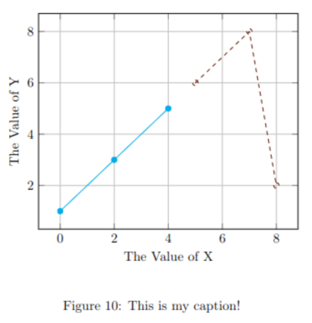

[](https://github.com/hughesjs/PgfPlotsSdk/actions)

[](LICENSE)
[](https://nuget.org/packages/PgfPlotsSdk/)
[](https://nuget.org/packages/PgfPlotsSdk/)


---

# PgfPlotsSdk

This is a C# library to enable developers to draw LaTex PGFPlots.

## Introduction

So far, the core of the library is in place. However, this is enough to plot line graphs, scatter plots, bar charts, and pie charts using the most common options. 

The [issue tracker](https://github.com/hughesjs/PgfPlotsSdk/) will show the most up to date roadmap, but the following is on the immediate roadmap:

- The ability to add and customise a legend.
- Adding a linter

An added benefit of taking this approach is it renders your data directly into the LaTex source files. This means compile times are dramatically reduced compared to reading them from a CSV file.

## How to Use

### Installing the Package

As with most C# packages, install it through Nuget via your IDE or the CLI.

`dotnet add <csproj> package PgfPlotsSdk`

It is also available as a package from the Github Image Repo.

### Creating a PgfPlot

Everything is done through the fluent builder API that I've created.

To begin, you need to create a new instance of the builder using `PgfPlotBuilder.CreateBuilder()`;

From here, it's fairly straightforward, the fluent API should guide you.

Let's say we wanted to create this graph:



To do this in C# you it's as simple as:

```cs
string res = PgfPlotBuilder.CreateBuilder().AddFigure()
    .SetPlacementFlag(PositionFlags.ForceExactlyHere)
    .SetCaption("This is my caption!")
    .SetLabel("fig:myfig")
    .AddPgfPlotWithAxes(AxisType.Standard)
    .SetXLabel("The Value of X")
    .SetYLabel("The Value of Y")
    .SetGrid(GridSetting.Both)
    .AddPlot(Data1)
    .SetColour(LatexColour.Cerulean)
    .SetMark(PlotMark.Star)
    .AddPlot(Data2)
    .SetColour(LatexColour.Sepia)
    .SetLineStyle(LineStyle.Dashed)
    .SetMark(PlotMark.Circle)
    .Build();
```

The output of this would be:

```tex
\begin{figure}[H]
\begin{tikzpicture}
\begin{axis}[xlabel=The Value of X, ylabel=The Value of Y, grid=both]
\addplot[color=Cerulean, mark=*] plot coordinates {(0,1) (2,3) (4,5)};
\addplot[color=Sepia, mark=o, dashed] plot coordinates {(5,6) (7,8) (8,2)};
\end{axis}
\end{tikzpicture}
\caption{This is my caption!}
\label{fig:myfig}
\end{figure}
```

### Rendering The Output

Currently, this SDK cannot render your LaTex, it is up to the consuming application to take the string output of the source generator and choose what to do with it. 

In the simplest case, the source can be dumped to a file and included with `\include{fPath}` into your LaTex document.

The following packages are needed if you want to use all of the features, some of these can be dropped if you don't need them (say if you don't want pie charts):

```tex
\usepackage[usenames,dvipsnames]{xcolor}
\usepackage{pgfplots}
\usepackage{pgf-pie}
\usepackage{pgffor}
\usepackage{float}
```